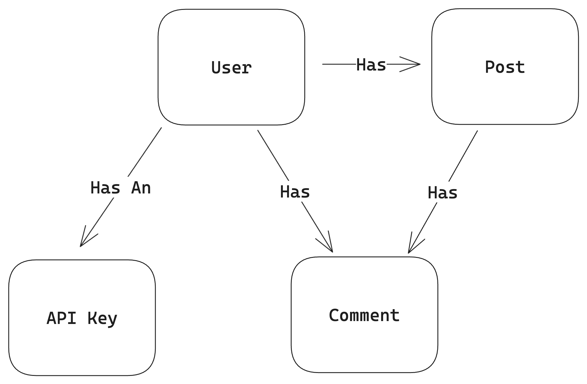

# Blog Engine with DynamoDB and API Gateway

An example of a blogging engine using API Gateway + Lambda functions as the backend, DynamoDB as the data store, and AWS CDK as the IaC tool.

## Table Design

Below are notes and artifacts created pre-development to give structure to the project.

### Entities

### Access Patterns

<table>
    <thead>
        <th>Entity</th>
        <th>Access Pattern</th>
        <th>Index</th>
        <th>Parameters</th>
        <th>Notes</th>
    </thead>
    <tbody>
        <tr>
            <td rowspan="2">User</td>
            <td>Create User</td>
            <td>Main Table</td>
            <td></td>
            <td></td>
        </tr>
        <tr>
            <td>Get User information</td>
            <td>Main Table</td>
            <td>PK=USER#&lt;username> AND SK=META#&lt;username></td>
            <td></td>
        </tr>
        <tr>
            <td rowspan="5">Post</td>
            <td>Create Post</td>
            <td>Main Table</td>
            <td></td>
            <td></td>
        </tr>
        <tr>
            <td>Get all Posts by User</td>
            <td>Main Table</td>
            <td>PK=USER#&lt;username> AND SK=begins_with(POST#)</td>
            <td></td>
        </tr>
        <tr>
            <td>Get all Posts sorted by creation date</td>
            <td>GSI1</td>
            <td>PK=POST</td>
            <td></td>
        </tr>
        <tr>
            <td>Get post and all comments</td>
            <td>Main Table</td>
            <td>PK=POST#&lt;slug></td>
            <td></td>
        </tr>
        <tr>
            <td>Delete Post</td>
            <td></td>
            <td></td>
            <td></td>
        </tr>
        <tr>
            <td>Comment</td>
            <td>Add Comment to a Post</td>
            <td></td>
            <td></td>
            <td></td>
        </tr>
    </tbody>
</table>

### Entity Primary Keys

| Entity | PK | SK | GSI1PK | GSI1SK |
| --- | --- | --- | --- | --- | 
| User | USER#\<username> | META#\<username> | | | 
| Post | USER#\<username> | POST#\<created_at> | POST | POST#\<created_at> |
| Comment | POST#\<slug> | COMMENT#\<uuid> | | |
